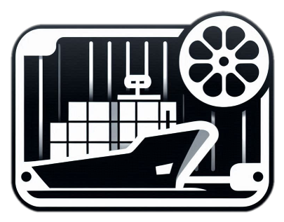

# HMS-Docker

## Introduction

ansible-hms-docker helps setup a home media server automation pipeline using many containers.

The idea was to go from a fresh OS install to a fully running media server after only installing Ansible and configuring variables.

Setting up the individual container configurations, such as for Sonarr, Radarr, Overseerr, Prowlarr, etc. are outside the scope of this project. The purpose of this project is to ensure the necessary base containers are running with the appropriate configs. There is a basic outline of how to connect the containers together in the [Container Connections](./Examples/container-connections.md) doc.

## Features

- Automatic Docker installation
- Automatic container/service updates
- Wildcard SSL certificate generation
- Dynamic DNS updates with Cloudflare
- GPU acceleration for media transcoding
  - Intel and Nvidia GPU support
  - You must install the drivers for your Nvidia GPU yourself, it is not included in this playbook, but it will verify GPU acceleration is available
- Support for multiple network shares
- Single Sign-On with Authentik
- Support for separate 4K instances of Sonarr and Radarr
- Automated dashboard configuration in [Homepage](https://gethomepage.dev/)
- Custom scripts
  - Advanced monitoring script(s) for Uptime-Kuma to detect if media is actually accessible by the Plex container
  - Convert Traefik certificate file to a Plex-supported certificate file (PKCS12)

## Contributing

Pull requests are always welcome!

If you have suggestions for containers to add or any other improvements, please submit a [Discussion Post](https://github.com/ahembree/ansible-hms-docker/discussions)

## Disclaimer

By using or running this code, you acknowledge and agree that it is provided **"as-is"** without any warranties or guarantees. The author(s) of this project are not responsible for any damages, data loss, or any other consequences that may result from the use or misuse of this code.

You use this code at your own risk. It is your responsibility to review and test the code in a safe environment before deploying it in production or on any system where data loss, corruption, or security risks could occur.

If you choose to run or implement this code, you do so with full knowledge of the potential risks involved.

Also the logos were generated by AI because I'm terrible at designing stuff.
